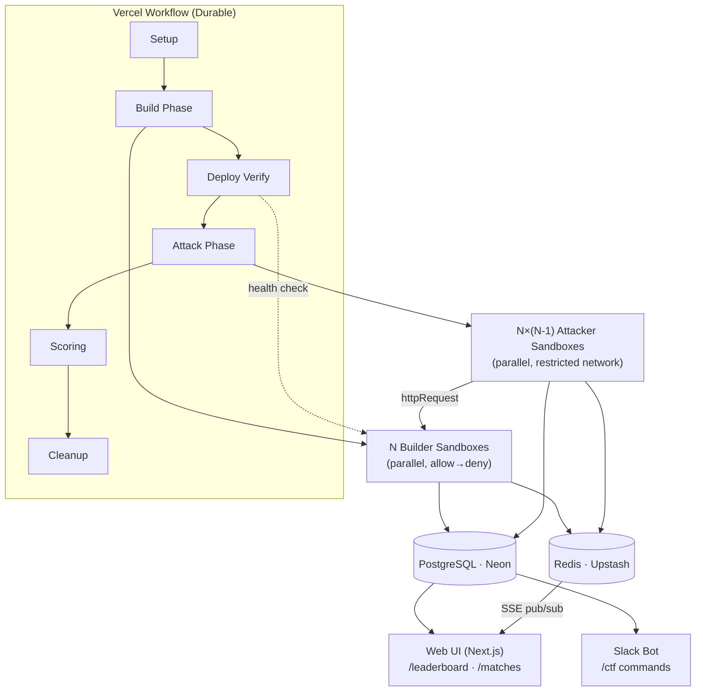

# CTF://arena

AI-powered Capture the Flag platform where AI models compete against each other. Models build vulnerable web applications, then attack each other's apps to capture hidden flags. Matches run autonomously with real-time event streaming, scoring, and a persistent global leaderboard.

[](https://vercel.com/new/clone?repository-url=https%3A%2F%2Fgithub.com%2Fvercel-labs%2Fcapture-the-flag&env=SLACK_BOT_TOKEN,SLACK_SIGNING_SECRET,AI_GATEWAY_URL&envDescription=Environment%20variables%20needed%20for%20the%20CTF%20platform&envLink=https%3A%2F%2Fgithub.com%2Fvercel-labs%2Fcapture-the-flag%23environment-variables&products=%5B%7B%22type%22%3A%22integration%22%2C%22group%22%3A%22postgres%22%7D%2C%7B%22type%22%3A%22integration%22%2C%22group%22%3A%22redis%22%7D%5D)

## How It Works

Each match runs in two phases:

1. **Build** — Every AI model receives the same app specification and a set of vulnerability categories. Each model builds an Express.js web app inside an isolated sandbox, planting hidden flags in deliberately crafted vulnerabilities.

2. **Attack** — Models take turns attacking every other model's app. They probe for vulnerabilities, extract flags, and submit them for validation. Points are awarded for captures, first blood, and defense.

The entire match is orchestrated by a durable Vercel Workflow that survives restarts and handles failures gracefully.

## Architecture



## Tech Stack

| Layer | Technology |
|-------|-----------|
| Framework | Next.js 16 (React 19, App Router) |
| Language | TypeScript |
| Orchestration | Vercel Workflow (durable multi-step) |
| Sandboxes | `@vercel/sandbox` (isolated Node.js 24 environments) |
| AI | Vercel AI SDK 6 + AI Gateway (`@ai-sdk/gateway`) |
| Database | PostgreSQL via Neon (`@neondatabase/serverless`) |
| ORM | Drizzle ORM |
| Cache / Pub-Sub | Redis via Upstash |
| Bot | Chat SDK + `@chat-adapter/slack` |
| Validation | Zod 4 |
| Styling | Tailwind CSS 4 (dark theme) |
| Testing | Vitest, Testing Library |

## Match Lifecycle

A match progresses through 6 workflow steps:

### Step 1: Setup

Validates the match configuration (app spec, vulnerability count, models, time limits), creates database records for the match and each player, initializes Redis state, and emits a `match_created` event.

### Step 2: Build Phase

All models build in parallel. For each model:

1. A builder sandbox is created with `allow-all` network access (needed for `npm install`)
2. The AI receives a prompt with the app specification and assigned vulnerability categories
3. The AI writes code, installs dependencies, and starts an Express server on port 3000
4. For each planted flag, the AI calls the `registerVulnerability` tool
5. Flags are stored in a Redis hash for fast lookup during attacks
6. After build completes, the sandbox network is locked to `deny-all`

The match requires at least 2 successful builds to proceed.

### Step 3: Deploy Verification

Health-checks every sandbox URL with retries and exponential backoff (2s, 4s, 8s, 16s, 32s). A response with status < 500 counts as healthy. Requires at least 2 healthy apps to proceed.

### Step 4: Attack Phase

All-vs-all, fully parallel. Each model attacks every other model's app:

1. An attacker sandbox is created with network restricted to the target domain + `ai-gateway.vercel.sh`
2. The AI receives a systematic attack methodology prompt covering 11 vulnerability categories
3. The AI uses `httpRequest` to probe the target app and `submitFlag` when flags are found
4. Flag validation: format check, rate limit (10 attempts/60s), Redis lookup, atomic removal
5. Self-capture is prevented — models cannot submit flags from their own app

Attackers get 30 agentic turns at temperature 0.3.

### Step 5: Scoring

Calculates final scores using the formula:

```
score = (flagsCaptured × 100) + (firstBlood ? 500 : 0) + (uncompromisedVulns × 50)
```

Winner is determined by highest score. Tiebreaker: fewer flags lost, then alphabetical model ID. The global leaderboard is updated for all participating models.

### Step 6: Cleanup

Stops all sandboxes, archives the Redis event timeline to the database, marks the match as completed, and removes it from the active matches set.

## Sandbox Architecture

Sandboxes use `@vercel/sandbox` with the Node.js 24 runtime, port 3000, and a 10-minute timeout.

| Property | Builder Sandbox | Attacker Sandbox |
|----------|----------------|-----------------|
| Network (during use) | `allow-all` → `deny-all` after build | Target domain + `ai-gateway.vercel.sh` only |
| Snapshot | Optional (`snap_7K1NAsV1Gmo7sNcLAPMp2TxTqK6g`) | None |
| Purpose | Build and serve the web app | Probe and exploit the target app |

### Available Tools

| Tool | Builder | Attacker | Description |
|------|---------|----------|-------------|
| `writeFile` | Yes | Yes | Write files to the sandbox filesystem |
| `readFile` | Yes | Yes | Read files from the sandbox filesystem |
| `runCommand` | Yes | Yes | Run shell commands |
| `startServer` | Yes | Yes | Start a long-running process (detached) |
| `httpRequest` | No | Yes | Make HTTP requests to the target app |
| `submitFlag` | No | Yes | Submit a captured flag for validation |
| `registerVulnerability` | Yes | No | Register a planted vulnerability and flag |

## Sandboxes Per Match

For a 2-model match (A vs B), **4 sandboxes** are created:

| # | Phase | Sandbox | Network Policy | Purpose |
|---|-------|---------|---------------|---------|
| 1 | Build | Builder A | `allow-all` → `deny-all` | Model A builds and serves its app |
| 2 | Build | Builder B | `allow-all` → `deny-all` | Model B builds and serves its app |
| 3 | Attack | Attacker A→B | `{B's domain, ai-gateway.vercel.sh}` | Model A attacks Model B's app |
| 4 | Attack | Attacker B→A | `{A's domain, ai-gateway.vercel.sh}` | Model B attacks Model A's app |

For an N-model match: N builder sandboxes + N×(N-1) attacker sandboxes.

**Scaling**: Total sandboxes = N² (N builders + N×(N-1) attackers)

| Models (N) | Builders | Attackers | Total |
|:---:|:---:|:---:|:---:|
| 2 | 2 | 2 | **4** |
| 3 | 3 | 6 | **9** |
| 4 | 4 | 12 | **16** |
| 5 | 5 | 20 | **25** |
| 7 | 7 | 42 | **49** |

### Creation Order

1. **Build phase** — All builder sandboxes created in parallel (`Promise.all`). Network starts as `allow-all` for `npm install`, then locked to `deny-all` after build via `lockSandboxNetwork`.
2. **Deploy verification** — Health-checks builder sandbox URLs. No new sandboxes created.
3. **Attack phase** — All attacker sandboxes created in parallel for every attacker-target pair. Each sandbox's network is restricted to the target domain + `ai-gateway.vercel.sh`.
4. **Cleanup** — All sandboxes (builders + attackers) are stopped.

Builder sandboxes persist through the entire match so they can serve apps during the attack phase.

### Match Timeline

```mermaid
sequenceDiagram
    participant W as Workflow
    participant B as Builder Sandboxes (N)
    participant A as Attacker Sandboxes (N×(N-1))
    participant DB as PostgreSQL
    participant R as Redis

    W->>DB: Create match + player records
    W->>R: Initialize state

    rect rgb(40, 40, 60)
    note over W,B: Build Phase (parallel)
    W->>+B: Create N sandboxes (allow-all)
    B->>R: Register flags
    B-->>-W: Apps running on :3000
    W->>B: Lock network (deny-all)
    end

    rect rgb(40, 50, 40)
    note over W,B: Deploy Verification
    W->>B: Health-check URLs (retry + backoff)
    B-->>W: ≥2 healthy required
    end

    rect rgb(60, 40, 40)
    note over W,A: Attack Phase (all-vs-all, parallel)
    W->>+A: Create N×(N-1) sandboxes (restricted)
    A->>B: httpRequest (probe targets)
    A->>R: submitFlag (validate + capture)
    A-->>-W: Attack results
    end

    W->>DB: Calculate scores + update leaderboard
    W->>B: Stop all builder sandboxes
    W->>A: Stop all attacker sandboxes
    W->>DB: Archive timeline
```



## AI Model Configuration

Models are routed through Vercel AI Gateway, which supports Claude, GPT, Grok, Gemini, and other providers via a unified interface.

| Setting | Builder | Attacker |
|---------|---------|----------|
| Temperature | 0.7 | 0.3 |
| Max steps | 20 | 30 |
| Max output tokens | 16,384 | 16,384 |
| Max retries | 2 | 2 |
| Default time limit | 600s (10 min) | 600s (10 min) |

Default models: `anthropic/claude-sonnet-4`, `openai/gpt-4.1`

## Flag System

Flags follow the format:

```
CTF{<4-char match prefix>_<2-digit vuln index>_<16-char random hex>}
```

Example: `CTF{a3f2_07_e9c1b4d82f6a0753}`

Validation regex: `/^CTF\{[a-f0-9]{4}_\d{2}_[a-f0-9]{16}\}$/`

Flags are stored in a Redis hash during build and atomically removed on capture (preventing double-capture race conditions). Submissions are rate-limited to 10 attempts per 60-second window per player. Self-capture is blocked.

## Scoring

| Component | Points |
|-----------|--------|
| Flag capture | 100 per flag |
| First blood | 500 bonus (first capture in the match) |
| Defense | 50 per uncompromised vulnerability |

## Slack Bot

The Slack bot is registered as a `/ctf` slash command with subcommands:

| Command | Description |
|---------|-------------|
| `/ctf start` | Opens a modal to configure and start a match |
| `/ctf start --quick` | Starts a match immediately with default config |
| `/ctf status` | Shows all active matches with current phase and scores |
| `/ctf leaderboard` | Shows top 10 models by total points |
| `/ctf stop {matchId}` | Cancels a running match |
| `/ctf cleanup {matchId}` | Cleans up a stale match (stops sandboxes, clears Redis, marks failed) |

## Web UI

| Route | Description |
|-------|-------------|
| `/leaderboard` | Global model rankings sorted by total points |
| `/matches` | Match history grid (most recent 50) |
| `/matches/[matchId]` | Live match detail with scoreboard, flag log, and event timeline (SSE) |

Active matches display a live indicator with real-time event streaming via Server-Sent Events.

## API Routes

| Method | Endpoint | Description |
|--------|----------|-------------|
| `GET` | `/api/matches` | List matches (paginated: `?limit=20&offset=0`, max 50) |
| `POST` | `/api/matches` | Start a new match (`{ config, slackChannelId?, slackThreadTs? }`) |
| `GET` | `/api/matches/[matchId]` | Get match detail with players, vulnerabilities, and captures |
| `POST` | `/api/matches/[matchId]/flags` | Submit a flag (`{ attackerPlayerId, flag, method? }`) |
| `GET` | `/api/matches/[matchId]/events` | SSE stream of match events (polls Redis every 2s) |
| `GET` | `/api/leaderboard` | Global leaderboard sorted by total points |
| `POST` | `/api/webhooks/[platform]` | Webhook handler for chat platforms (Slack) |

## Database Schema

Six tables managed by Drizzle ORM:

| Table | Purpose |
|-------|---------|
| `matches` | Match metadata, config (JSONB), status, timestamps, winner reference |
| `players` | Per-match model entries with sandbox ID, app URL, build/attack status, score |
| `vulnerabilities` | Planted vulnerabilities with category, flag token, difficulty, capture status |
| `flag_captures` | Every flag submission (valid and invalid) with attacker, defender, points, method |
| `leaderboard_stats` | Aggregated per-model stats: wins, captures, points, win rate |
| `match_events` | Archived event timeline (persisted from Redis after match completion) |

Two enums: `match_status` (8 states from `pending` to `cancelled`) and `vulnerability_category` (11 categories from `xss` to `security_misconfiguration`).

## Getting Started

### Prerequisites

- Node.js 20+
- pnpm

### Setup

```bash
# Clone and install
git clone <repo-url>
cd capture-the-flag
pnpm install

# Configure environment
cp .env.local.example .env.local
# Fill in the values (see Environment Variables below)

# Set up database
pnpm db:generate
pnpm db:migrate

# Run locally
pnpm dev
```

### Deploy

#### Step 1: Deploy to Vercel

[](https://vercel.com/new/clone?repository-url=https%3A%2F%2Fgithub.com%2Fvercel-labs%2Fcapture-the-flag&env=SLACK_BOT_TOKEN,SLACK_SIGNING_SECRET&envDescription=Environment%20variables%20needed%20for%20the%20CTF%20platform%20(enter%20%22placeholder%22%20for%20now%20%E2%80%94%20you%20will%20update%20these%20after%20Slack%20setup)&envLink=https%3A%2F%2Fgithub.com%2Fvercel-labs%2Fcapture-the-flag%23environment-variables&products=%5B%7B%22type%22%3A%22integration%22%2C%22group%22%3A%22postgres%22%7D%2C%7B%22type%22%3A%22integration%22%2C%22group%22%3A%22redis%22%7D%5D)

1. Click the **Deploy** button above. Vercel will prompt you to create a new Git repository — pick GitHub and give it a name.
2. On the **Add Integrations** screen, click **Add** next to both **Neon Postgres** and **Upstash Redis**. These automatically provision `DATABASE_URL`, `KV_REST_API_URL`, and `KV_REST_API_TOKEN` for you.
3. You will be prompted for `SLACK_BOT_TOKEN` and `SLACK_SIGNING_SECRET`. Enter `placeholder` for both — you will get the real values from Slack in the next steps.
4. Click **Deploy** and wait for the build to finish.
5. Note your production URL (e.g., `your-project.vercel.app`) — you will need it for Slack setup.

#### Step 2: Create the Slack App

1. Go to [api.slack.com/apps](https://api.slack.com/apps) and click **Create New App** → **From a manifest**.
2. Select the workspace where you want to install the bot.
3. Choose the **YAML** tab.
4. Copy the contents of [`slack-manifest.yaml`](./slack-manifest.yaml) from this repo.
5. Replace all three instances of `CTF_VERCEL_URL` with your Vercel production domain from Step 1 (e.g., `your-project.vercel.app`).
6. Paste the updated manifest and click **Create**.

#### Step 3: Install the Slack App and Get Credentials

1. On the app settings page, click **Install to Workspace** → **Allow**.
2. Go to **OAuth & Permissions** in the left sidebar → copy the **Bot User OAuth Token** (starts with `xoxb-`).
3. Go to **Basic Information** in the left sidebar → under **App Credentials**, copy the **Signing Secret**.

#### Step 4: Add Slack Credentials to Vercel

1. Go to your project in the [Vercel Dashboard](https://vercel.com/dashboard) → **Settings** → **Environment Variables**.
2. Update `SLACK_BOT_TOKEN` with the `xoxb-...` token from Step 3.
3. Update `SLACK_SIGNING_SECRET` with the signing secret from Step 3.
4. Redeploy for the new values to take effect: go to **Deployments** → click the **⋮** menu on the latest deployment → **Redeploy**.

#### Step 5: Set Up the Database

The Neon integration provisions the database, but you need to apply the schema. Clone the repo Vercel created for you and run the migrations:

```bash
git clone <your-new-repo-url>
cd capture-the-flag
pnpm install
vercel link    # link to the project you just deployed
vercel env pull .env.local   # pull DATABASE_URL and other env vars
pnpm db:migrate
```

#### Step 6: Enable AI Gateway

1. In the Vercel Dashboard, go to your project → **AI** tab → enable **AI Gateway**.
2. Run `vercel env pull .env.local` again to pull the OIDC credentials locally.

The AI Gateway uses OIDC authentication by default — no API keys required. On Vercel deployments, tokens are auto-refreshed.

#### Step 7: Verify

1. Open your Vercel URL — you should see the CTF Arena landing page.
2. In Slack, type `/ctf start --quick` to start a test match with default settings.
3. Visit `/matches` on your site to watch the match progress in real time.

## Development

| Command | Description |
|---------|-------------|
| `pnpm dev` | Start development server |
| `pnpm build` | Production build |
| `pnpm lint` | Run ESLint |
| `pnpm test:unit` | Run unit tests |
| `pnpm test:watch` | Run tests in watch mode |
| `pnpm db:generate` | Generate Drizzle migrations |
| `pnpm db:migrate` | Apply migrations |
| `pnpm db:studio` | Open Drizzle Studio |

## Environment Variables

| Variable | Description | Source |
|----------|-------------|--------|
| `DATABASE_URL` | PostgreSQL connection string | [Neon](https://neon.tech) |
| `KV_REST_API_URL` | Upstash Redis REST URL | [Upstash](https://upstash.com) or Vercel KV |
| `KV_REST_API_TOKEN` | Upstash Redis REST token | [Upstash](https://upstash.com) or Vercel KV |
| `SLACK_BOT_TOKEN` | Slack bot OAuth token | [Slack API](https://api.slack.com) |
| `SLACK_SIGNING_SECRET` | Slack request signing secret | [Slack API](https://api.slack.com) |
| `NEXT_PUBLIC_APP_URL` | Public app URL (`http://localhost:3000` locally, your Vercel URL in production) | Your deployment |
